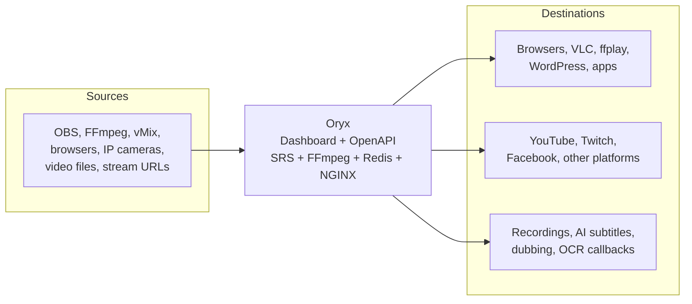

# Oryx Overview

## What is Oryx

Oryx (formerly SRS Stack) is an **all-in-one, out-of-the-box, open-source video solution** for creating live streaming and WebRTC services in the cloud or through self-hosting.

Oryx integrates SRS, FFmpeg, a Go backend, a React web dashboard, Redis, and NGINX into a single-node application. SRS provides the underlying media-server capabilities, while Oryx adds user-facing workflows such as authentication, automatic HTTPS, recording, restreaming, virtual live events, IP-camera streaming, transcoding, HTTP APIs, callbacks, and AI-powered media features.

## How Oryx Works With Tools



**Sources:**

- **OBS, FFmpeg, and vMix** — Publish live streams through RTMP, SRT, or WHIP, depending on the tool.
- **Browsers** — Publish camera and microphone streams through WHIP after HTTPS is enabled.
- **IP cameras and stream URLs** — Oryx uses managed FFmpeg tasks to pull sources such as RTSP streams and send them to Oryx or external platforms.
- **Video files** — Uploaded files or files under `/data` can be used for virtual live events and AI dubbing.

**Integrated services:**

- **Dashboard and OpenAPI** — Configure and operate Oryx through the web interface or documented `/terraform/v1/` APIs.
- **SRS** — Receives, converts, and distributes live streams through RTMP, SRT, WebRTC, HLS, and HTTP-FLV.
- **FFmpeg** — Handles restreaming, virtual live events, camera ingest, video transcoding, recording post-processing, and AI media pipelines.
- **Redis** — Stores Oryx configuration and task state under the persistent `/data` volume.
- **NGINX** — Provides HTTP and HTTPS access, reverse proxying, and delivery of web and media resources.
- **OpenAI services (optional)** — Power transcription, the voice assistant, dubbing, and OCR when configured by the user.

**Destinations:**

- **Browsers and media players** — Play streams through WHEP, HLS, HTTP-FLV, RTMP, or SRT as supported by the player.
- **Websites and apps** — Embed playback through browser players, the WordPress plugin, or custom applications.
- **Streaming platforms** — Restream live sources or virtual live events to destinations such as YouTube, Twitch, and Facebook.
- **Files and integrations** — Save recordings, generate dubbed media or subtitles, and deliver event or OCR results through HTTP callbacks.

## Protocols (Each Supports Input AND Output)

The following protocols support both publishing to and playing from Oryx:

- **RTMP** — Publish with OBS, FFmpeg, vMix, or another RTMP encoder; play with RTMP-compatible software. RTMP uses TCP and is the traditional live-streaming workflow.
- **SRT** — Publish and play with SRT-compatible broadcast tools such as OBS, vMix, FFmpeg, or ffplay. SRT uses UDP and is designed for reliable, low-latency contribution over imperfect networks.
- **WebRTC** — Publish through WHIP and play through WHEP using browsers, OBS, or compatible applications. WebRTC normally transports media over UDP and provides the lowest-latency Oryx workflow; browser publishing requires a secure context such as HTTPS.

Oryx also uses these one-directional protocols in documented scenarios:

- **HLS and HTTP-FLV** — Playback outputs generated from published live streams. They are not publishing inputs in the standard Oryx workflow.
- **RTSP** — An input for the IP-camera workflow. Oryx uses FFmpeg to pull the camera stream and republish or forward it; Oryx does not expose RTSP as a general playback output.

## Most Common Usage

The simplest Oryx workflow is to run the Docker image, publish an RTMP stream from OBS, and play it through a dashboard-generated browser link.

Step 1: Run Oryx with persistent storage.

```bash
docker run --restart always -d -it --name oryx -v $HOME/data:/data \
  -p 80:2022 -p 443:2443 -p 1935:1935 -p 8000:8000/udp -p 10080:10080/udp \
  ossrs/oryx:5
```

The `$HOME/data:/data` mount is required to preserve the administrator password, publish secret, certificates, Redis data, recordings, uploads, and feature configuration across container restarts.

Step 2: Open [http://localhost](http://localhost) and set the administrator password when prompted.

For a remote server, replace `localhost` with the server's reachable IP address or domain name. Ensure the required ports are allowed by the host firewall and cloud security rules.

Step 3: In the dashboard, open `Scenarios > Streaming > RTMP: OBS or vMix`. Copy the generated **Server** and **Stream Key** values into OBS, then start streaming.

The stream key contains Oryx's global publish secret. Treat it as sensitive, do not expose it in logs or screenshots, and do not append it to playback URLs.

Step 4: Use the playback links generated by the dashboard to preview the stream through HLS, HTTP-FLV, WebRTC/WHEP, or another supported player.

For browser publishing through WHIP, configure HTTPS and use a reachable private IP, public IP, or domain rather than `localhost` or `127.0.0.1`. Also allow WebRTC media on UDP port 8000.

## Features

**Streaming and delivery:**

- **Multi-protocol live streaming** — Publish through RTMP, SRT, or WHIP/WebRTC and play through RTMP, SRT, WHEP/WebRTC, HLS, or HTTP-FLV.
- **Web dashboard** — Generates publishing and playback URLs and provides scenario-oriented setup and status views without requiring raw SRS configuration.
- **Website integration** — Supports browser playback, custom applications, and the SRS Player plugin for WordPress.
- **HLS delivery** — Generates HLS for broadly compatible playback and offers an optional NGINX HLS CDN workflow for larger delivery workloads.

**Security and operation:**

- **Administrator authentication** — Protects access to the Oryx dashboard and management functions.
- **Publish authentication** — Generates a global publish secret and verifies RTMP, SRT, and WHIP publishers. The documented standard workflow does not add the secret to playback URLs.
- **Automatic HTTPS** — Requests and renews Let's Encrypt certificates through LEGO, enabling secure dashboard access and browser camera or microphone use.
- **Persistent state** — Stores configuration, certificates, Redis data, recordings, uploads, and generated media under `/data`.
- **HTTP OpenAPI** — Exposes documented `/terraform/v1/` APIs and proxies selected SRS APIs under `/api/` with Oryx authentication.
- **HTTP callbacks** — Sends publishing, unpublishing, recording, and OCR events to an external application.

**Media workflows:**

- **Recording** — Records selected live streams, supports stream filters and merged publishing sessions, generates MP4 artifacts, and saves them to local disk or documented cloud-storage targets.
- **Multi-platform restreaming** — Forwards live streams to destinations such as YouTube, Twitch, and Facebook and can select another available input when the active source stops.
- **Virtual live events** — Loops or publishes prerecorded files and other media sources as live streams, including continuous 24/7 workflows.
- **IP-camera streaming** — Pulls RTSP camera streams and forwards them to Oryx or external streaming platforms; a silent audio track can be added for video-only cameras when required.
- **Live transcoding** — Uses managed FFmpeg tasks to change bitrate, resolution, or filters and publishes the processed stream back to Oryx.

**AI features:**

- **Live transcription** — Uses speech recognition to generate subtitles, including burned-in text and HLS WebVTT output.
- **Voice assistant** — Provides a browser-based voice and text assistant for live rooms, language coaching, translation, and other prompt-driven conversations.
- **Video dubbing** — Transcribes, translates, synthesizes speech, adjusts audio segments, and exports multilingual video artifacts.
- **Stream OCR** — Extracts text, objects, or scene descriptions from live-stream images using configurable instructions and delivers results through the dashboard or HTTP callbacks.

AI features require the user to configure a supported OpenAI service. The voice assistant, dubbing, and OCR are documented as beta features, and availability may vary by Oryx version.

## Dependencies

Oryx is distributed as an integrated application, normally through the `ossrs/oryx` Docker image. Users of the image do not need to install each internal dependency separately.

**Core components:**

- **SRS** — Provides the media-server engine for RTMP, SRT, WebRTC, HLS, and HTTP-FLV streaming.
- **FFmpeg and ffprobe** — Process media for recording, restreaming, virtual live events, camera ingest, transcoding, transcription, dubbing, and OCR workflows.
- **Redis** — Stores configuration, authentication data, and persistent task state. Its data is preserved through the `/data` mount.
- **NGINX** — Provides HTTP/HTTPS proxying and serves web and media resources. Oryx also documents a separate optional NGINX HLS CDN workflow.
- **Go** — Implements the Oryx backend and HTTP services.
- **React** — Implements the web dashboard; its compiled static assets are included in release images.
- **LEGO** — Requests and renews Let's Encrypt certificates for automatic HTTPS.
- **youtube-dl** — Downloads supported online media sources for workflows that accept a remote video source.

**Feature-specific external services:**

- **OpenAI services** — Optional and required only for configured transcription, voice-assistant, dubbing, or OCR features.
- **Streaming platforms** — YouTube, Twitch, Facebook, or another compatible destination is required only for restreaming, virtual live, or camera-forwarding workflows.
- **Cloud storage services** — Required only when recordings are configured for a documented cloud-storage target instead of local `/data` storage.

**Deployment and development:**

- **Docker** — The recommended deployment method and the simplest way to run the complete Oryx stack.
- **Helm** — An alternative documented deployment method for Kubernetes.
- **Go and Node.js toolchains** — Required when building the backend and React dashboard from source, but not when running the published Docker image.

## Limitations

- **Single-node design** — Oryx is an integrated single-node application, not a built-in media cluster. Multiple Docker instances can run on one or more machines, but they remain isolated and require separate ports, `/data` directories, and external coordination.
- **Shared publish secret** — The documented authentication model uses one global publish secret for all streams. It does not provide an independent secret for each stream.
- **Manual upgrades** — Oryx does not upgrade itself from the dashboard. Docker, Helm, script, and aaPanel deployments must be upgraded through their documented platform-specific procedures.
- **Persistent storage is operationally required** — Running without a persistent `/data` mount risks losing passwords, publish secrets, certificates, Redis data, recordings, uploads, and feature configuration when the container is replaced.
- **Capacity depends on one host** — Concurrent streams, FFmpeg tasks, recording, transcoding, AI processing, and outbound delivery share the same machine's CPU, memory, disk, and bandwidth.
- **AI services are external and partly beta** — AI features depend on configured OpenAI service availability, latency, quotas, and cost. The voice assistant, dubbing, and OCR are documented as beta features and may differ between Oryx versions.

The Oryx 5 README also lists GB28181, WebRTC face-to-face chat, WebRTC video rooms, and integrated Prometheus/node-exporter monitoring as unfinished work. Check documentation for the exact deployed version before assuming these gaps still apply.

## Configuration

Oryx is primarily configured through its web dashboard. Use the scenario and system pages for streaming, authentication, HTTPS, recording, restreaming, virtual live, camera, transcoding, callbacks, and AI settings rather than treating Oryx as a standalone SRS configuration.

**Persistent configuration:**

- Mount a host directory at `/data`; the standard Docker command uses `$HOME/data:/data`.
- Oryx stores its environment file, generated SRS and NGINX configuration, SSL files, Redis data, and feature state under `/data`.
- The main environment file is `/data/config/.env`. Restart Oryx after changing it.
- Protect `/data/config/.env` because it may contain the administrator password and other sensitive values.
- Do not replace Oryx-generated files with examples from standalone SRS unless version-matched Oryx documentation explicitly instructs you to do so.

**Common environment variables:**

- `MGMT_PASSWORD` — Sets the administrator password. Treat its value as a secret.
- `REACT_APP_LOCALE` — Selects the dashboard language, documented as `en` or `zh` with `en` as the default.
- `HTTP_PORT`, `RTMP_PORT`, `RTC_PORT`, and `SRT_PORT` — Tell Oryx which externally exposed ports to display and use when Docker port mappings differ from the defaults.
- `MGMT_LISTEN`, `PLATFORM_LISTEN`, and `HTTPS_LISTEN` — Control internal HTTP service listen ports; the documented defaults are 2022, 2024, and 2443.
- `CANDIDATE` — Overrides the WebRTC candidate when automatic resolution from the request host is unsuitable.
- `NAME_LOOKUP` — Enables or disables candidate resolution from the HTTP request host; the documented default is `on`.
- `AUTO_SELF_SIGNED_CERTIFICATE` — Enables or disables automatic creation of a self-signed certificate; the documented default is `on`.
- `SRS_FORWARD_LIMIT` and `SRS_VLIVE_LIMIT` — Limit concurrent forwarding and virtual-live tasks; each has a documented default of 10.
- `REDIS_PASSWORD` and `REDIS_PORT` — Configure Oryx's Redis connection when the default bundled setup is not used.

Development-only variables such as `NODE_ENV`, `LOCAL_RELEASE`, `PLATFORM_DOCKER`, `PUBLIC_URL`, `BUILD_PATH`, and `GO_PPROF` should not normally be changed in a production Docker deployment.

**Default exposed ports:**

- `80/TCP` mapped to Oryx `2022/TCP` — HTTP dashboard, OpenAPI, and HTTP media delivery.
- `443/TCP` mapped to Oryx `2443/TCP` — HTTPS dashboard, API, signaling, and secure HTTP media delivery.
- `1935/TCP` — RTMP publishing and playback.
- `8000/UDP` — WebRTC media transport.
- `10080/UDP` — SRT publishing and playback.

When changing host-side port mappings, use unique ports and set `HTTP_PORT`, `RTMP_PORT`, `RTC_PORT`, and `SRT_PORT` so dashboard-generated URLs match the deployment.

**OpenAPI automation:**

- Use `System > OpenAPI` to obtain a Bearer token for protected `/terraform/v1/` APIs.
- Public version and health endpoints do not require the management token.
- Never store Bearer tokens, publish secrets, destination stream keys, or OpenAI keys in public scripts, logs, screenshots, or documentation.
